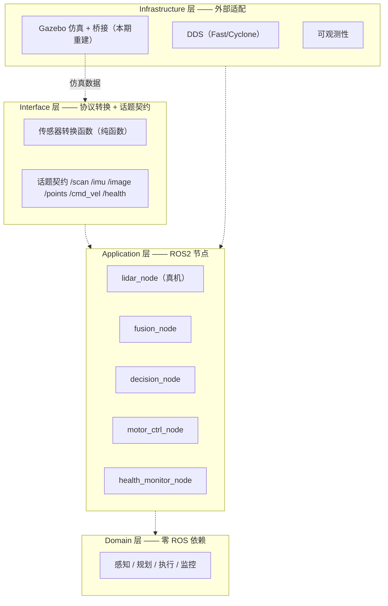
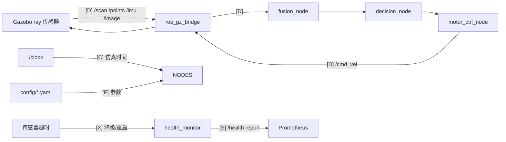
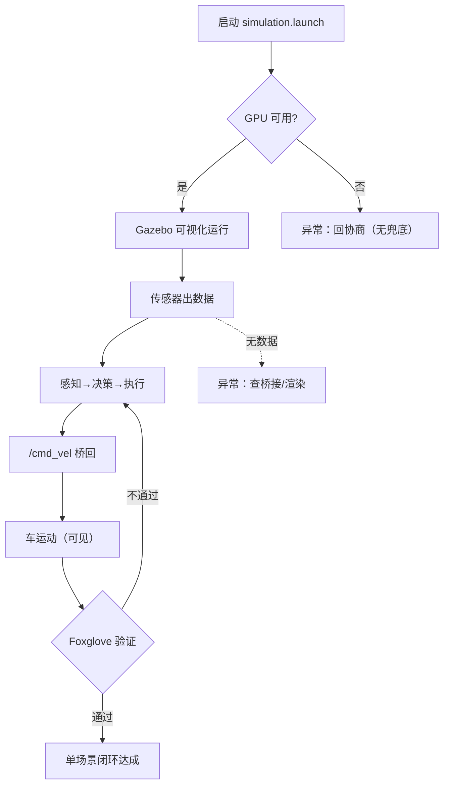
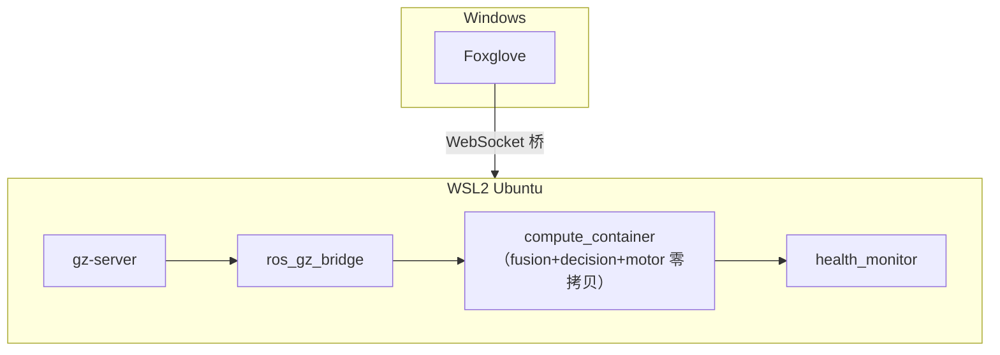

# 重构策略文档（strategy.md 产出）

> 生成日期：2026-08-02
> 模式：重构（仿真层大爆炸 + HAL 绞杀者）
> 上游：`iso-output.md`（仿真验证环断链 → 可视化仿真重建 + 单场景闭环）
> 下游：子系统实现（operations/cpp.md）、集成测试（operations/integration.md）
> 备份：旧版（质量门禁聚焦）见 `ros2_amr_framework-strategy-quality-gate.bak.md`

---

## 0. 重构前置结论

| 项 | 结论 |
|----|------|
| 迁移策略 | 仿真层**大爆炸**（全砍重建，隔离外部层 blast radius 小）；HAL ISensor **绞杀者**（逐步剥，验证 /scan 不变） |
| 向后兼容 | `/scan` `/imu` `/image` 必保持同名同型；`/cmd_vel` 新增 ros→gz 方向；PointCloud2 为 additive |
| 增量替换优先级 | 风险最低优先：R1 渲染实测 → R2 仿真重建 → R3 可视化 → R5 ISensor → R4 闭环 |

## 1. 需求边界确认表

| 需求ID | 需求描述 | 状态 | 风险/依赖 | 替代方案/分期计划 |
|--------|----------|------|-----------|-------------------|
| R1 | WSL2 渲染层 GPU 实测 | ⚠️ | GPU 通道在（/dev/dxg ✅），渲染后端未验证 | 实测失败→排查 Mesa D3D12/NVIDIA Vulkan ICD；无可视化兜底，回协商 |
| R2 | 仿真从零重建（/cmd_vel 桥 + PointCloud2 + GPU 渲染） | ✅ | 依赖 R1 | - |
| R3 | 可视化闭环（Foxglove 点云 + Gazebo 车动） | ✅ | 依赖 R2 | Foxglove 跑 Windows 侧 |
| R4 | 单场景巡检闭环跑通 | ✅ | 依赖 R2/R3 | - |
| R5 | 移除 ISensor + SensorRegistry | ✅ | 影响 HAL/lidar_node | 纯转换函数 + 话题级仿真 |
| R6 | 最小 world + 单传感器先跑通 | ✅ | 依赖 R2 | - |

## 2. 可行性分析

### 2.1 业务现状
- 当前验证流程：场景 → 车模型 → 桥接 → /scan → 管线 → /cmd_vel（**未桥回**，车不动）→ 可视化（**无点云话题**，看不见）
- 痛点：感知验证=0（点云不可见）、执行验证=0（车不动）、渲染后端未知
- 三根因已定位：缺 `/cmd_vel` 桥、无 PointCloud2、gpu_lidar+WSL2 死结

### 2.2 可复用设计
- 核心模型：场景 → 传感器模型 → 桥接 → 话题契约 → 管线 → 命令 → 场景状态更新 → 可观察
- 可复用（直接给任何客户）：Domain 算法（零 ROS）· 进程拓扑 · 桥接模式 · DDS 双实现
- 必须重新做（换客户）：场景/车模型 · 传感器配置 · 巡检任务定义

### 2.3 演进路线
| 阶段 | 里程碑 |
|------|--------|
| 本期 | 单场景可视化闭环 |
| 阶段2 | 多场景自主跑通（GPU + 自动化）→ DDS 精通 |
| 阶段3 | 车队（fleet + 多车间） |
| 阶段4 | AI 编排（场景自适应 + 负载均衡） |

## 3. 设计愿景

### 3.1 终局/长期路线
一个"仿真可信、可自主验证、最终成车队"的 AMR 平台。核心价值体验：**任何算法改动，拉起一个仿真场景，几分钟内看到它在可信环境下的表现**。阶段退出标准：单场景闭环（本期）→ 多场景自动化（一条命令出验证报告）→ 车队（多车协同）→ AI 编排（目标输入→自动编排）。与现状三大差距：① 看不见→全程可见 ② 手动单场景→自动多场景 ③ 单机→车队+AI。

### 3.2 可复用设计沉淀
① Domain 算法库（零 ROS 依赖）② DDS 选型与适配方法论（benchmark + QoS 清单）③ 仿真验证闭环模板（world+bridge+launch）。SOP：从场景到验证报告的流水线。经验：契约早定、GPU 早实测、抽象等真实多厂商再引入。

### 3.3 业务差异点
全链路自研 + 验证闭环优先（对比 Nav2 组合/闭源商业栈）。最难复制：Domain 零 ROS 依赖的架构纪律 + DDS 选型实证数据。选你的理由："从场景到验证报告"的完整方法论 + 每步可复现。

## 4. 架构设计

### 4.1 分层架构图

### 4.2 数据流转图（五色）

`[D]`=数据(蓝) `[C]`=控制(橙) `[S]`=状态(紫) `[X]`=异常(红) `[F]`=配置(绿)

### 4.3 业务流程图

### 4.4 部署图

### 4.5 子系统边界定义

| 子系统 | 职责 | 输入 | 输出 | 依赖 |
|--------|------|------|------|------|
| sim_bridge（重建） | 场景+车模型+gz↔ros2 桥接 | world/sdf | /scan /points /imu /image /cmd_vel | 无 |
| sensor_adapter（缩减） | 真机转换纯函数 | SICK 原始 | LaserScan | 无 |
| perception（保留） | 感知/融合/降级 | /scan /imu | 障碍/目标 | Domain |
| planning（保留） | 规划/避障 | 感知输出 | 轨迹 | Domain |
| execution（保留） | PurePursuit | 轨迹 | /cmd_vel | Domain |
| monitoring（保留） | 心跳/恢复 | 心跳 | /health report | Domain |
| compute_container（保留） | 零拷贝容器 | 话题 | 话题 | 感知/规划/执行 |
| health_monitor（保留） | 独立看门狗 | 心跳 | 重启/报告 | monitoring |

### 4.6 关键决策记录

| 决策 | 选项 | 决策 | 理由 | 代价 |
|------|------|------|------|------|
| D1 仿真重建方式 | A 修旧 / B 全砍重建 | **B** | 旧结构三缺陷+hack，修复≈重写；砍 ISensor 后路径本就简化 | 重写 world/launch，复用旧 SDF |
| D2 ISensor 移除深度 | A 全砍 / B 留薄接口 | **A** | 2 适配器无质变支撑点；/scan 契约提供一致性 | 多厂商时重引抽象（符合三行原则） |
| D3 GPU 渲染后端 | A Vulkan / B Mesa D3D12 / C GL | **G0 实测后定，倾向 A** | /dev/dxg 在，NVIDIA Vulkan 是直通路径 | 装工具链；失败走 B |
| D4 PointCloud2 生成 | A gz 直出 / B 转换节点 | **A** | 少一跳，gz 原生支持 | ray 配置需调 |

## 5. 接口契约

详见 [contracts/](../contracts/)：
- `README.md`：话题契约表 + 版本管理策略
- `bridge-contract.md`：gz↔ros2 桥接映射（法律文件）

## 6. 迭代计划

| 迭代 | 周期 | 交付物 | 依赖 | 人力 | AI占比 | 验收标准 |
|------|------|--------|------|------|--------|----------|
| I1 | D1-2 | 环境实测报告（R1） | - | 1人 | 40% | 渲染 GPU 结论 + 工具链就绪 |
| I2 | D3-7 | 仿真重建（R2+R6） | I1 | 1人 | 70% | 新 launch 跑通，桥接契约全通 |
| I3 | D8-12 | 可视化闭环（R3） | I2 | 1人 | 60% | Foxglove 点云 + 车动 |
| I4 | D8-12 | ISensor 绞杀（R5） | I2 | 1人 | 60% | /scan 不变，删除接口+注册表，测试绿 |
| I5 | D13-15 | 单场景闭环（R4） | I3+I4 | 1人 | 50% | 巡检录屏 + 验证报告 |

- **关键路径**：I1 → I2 → I3 → I5
- **并行机会**：I3 ∥ I4
- **技术预研**：G0 渲染后端（I1）、bridge↔Jazzy 兼容（I2）、gz ray 点云配置（I2）
