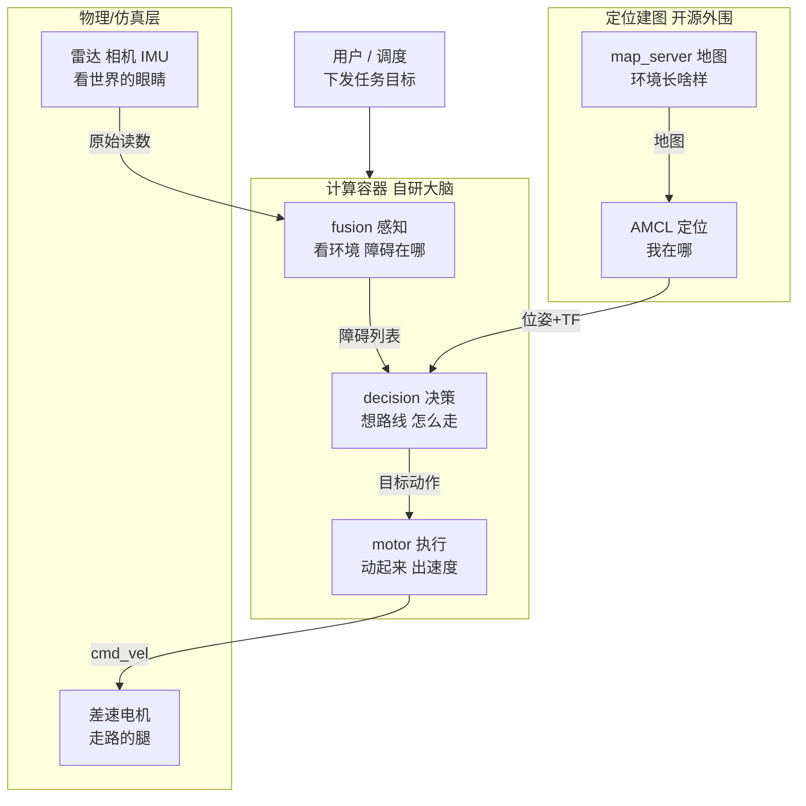
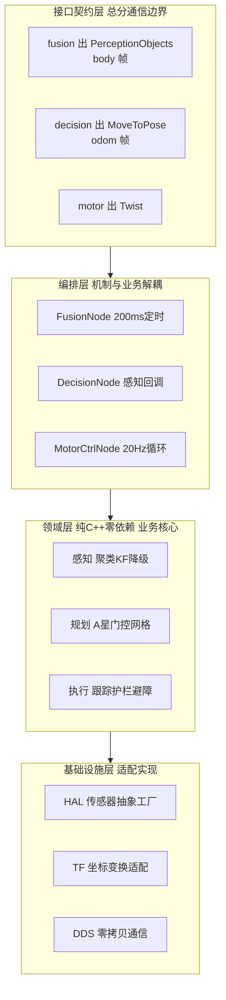
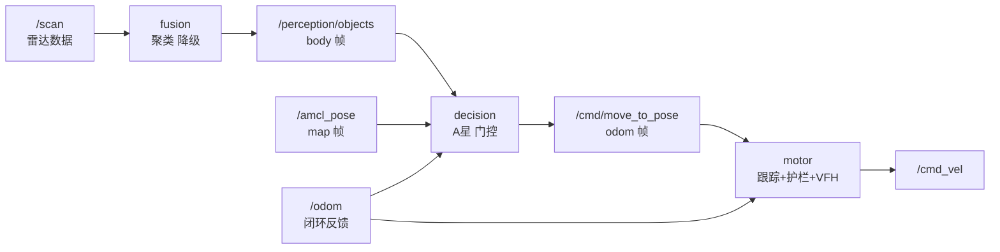
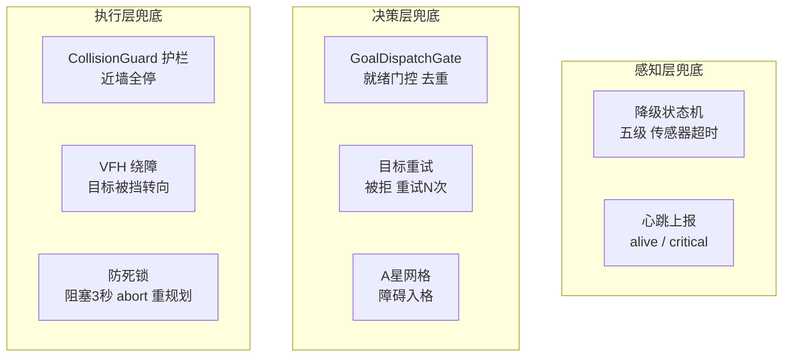
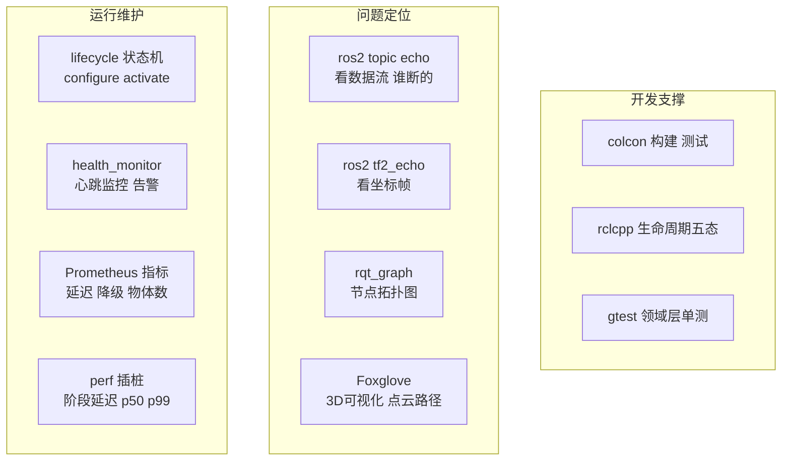

# 计算容器总体方案（图文）

> 用途：计算容器（fusion→decision→motor）的架构剖析与业务梳理，供开发/复盘/面试演示使用。
> 日期：2026-08-08 建立
> 基线：基于 GoalDispatchGate 修复后的最新代码（重复派发/冷启动门控已修，穿墙确认为仿真传感器问题，见附录）。
> 图表规范：`/home/guang/code/prompt/references/diagram-spec.md` §6（Mermaid 渲染规避规则）。
> 视角：业务分工 → 技术架构 → 技术细节/兜底 → ROS2 工具链 → 故障树反向剖析。

---

## 0. 计算容器的核心地位

**计算容器 = 自研大脑，其余全是可以替换的开源外围。**

| 归属 | 组件 | 作用 |
|---|---|---|
| 自研（核心价值） | fusion 感知 / decision 决策 / motor 执行 | 全链路业务逻辑 |
| 开源外围 | AMCL 定位 / map_server 地图 / EKF 里程 / Gazebo 仿真 | 可替换的标准组件 |
| 物理层 | LiDAR / IMU / 相机 / 差速电机 | 传感器与执行器 |

一句话：**"感知-决策-执行"三段闭环是护城河，定位/建图/仿真换哪家都行。**

---

## 1. 业务视角：有哪些模块、怎么分工

| 模块 | 业务职责 | 关键产物 |
|---|---|---|
| fusion | 回答"障碍在哪" | `/perception/objects` 障碍列表 + 降级心跳 |
| decision | 回答"去哪、怎么绕" | `/cmd/move_to_pose` 动作目标 + `/planning/path` 路径 |
| motor | 回答"现在给多大速度" | `/cmd_vel` 速度指令 |
| AMCL | 回答"车在地图哪" | `/amcl_pose` + map→odom TF |
| 传感器进程 | 提供原始读数 | `/scan` `/imu` `/camera` |

**业务隔离的关键**：决策只吃感知的**产物**（障碍列表），不吃原始数据——感知怎么做的、用什么传感器，决策不关心。

---

## 2. 技术架构视角：分层如何解决业务问题

回答的问题：**业务模块（fusion/decision/motor）在技术上怎么落地、每层技术为什么存在**。用三种图形式交叉表达：矩阵（对应关系）→ 分层图（结构）→ 溯源表（为什么）。

### 2a · 业务 × 技术映射矩阵（每格 = 该业务模块在该层的组件）

| 业务模块 | 接口契约层 | 编排层 | 领域层 | 基础设施层 |
|---|---|---|---|---|
| **fusion** | `PerceptionObjects` msg + sensors.yaml | FusionNode 200ms 定时 + 生命周期 | PerceptionService + 聚类/KF/降级 | HAL 传感器工厂 + TF 变换 |
| **decision** | `MoveToPose` action + goal 参数 | DecisionNode 感知回调 + 派发 | A* + 网格 + GoalDispatchGate + 平滑 | TF buffer + action client |
| **motor** | `Twist` msg | MotorCtrlNode 20Hz 循环 | PurePursuit + 护栏 + VFH + 平滑 | odom/scan 订阅 + DDS |

**这张表回答"业务和技术如何对应"**：业务是行（三个子系统），技术是列（四层）。每个业务子系统不是单一模块，而是**横跨四层的纵向切片**——业务逻辑（领域层）居中，上下被接口契约和基础设施包裹。技术架构不是另起一摊，而是每个业务模块的内在骨架。

### 2b · 分层结构图（每层承载三个业务模块的组件）

**读法**：纵向读 = 业务链路（每层都有 fusion/decision/motor 三列组件，接口层三个 msg 就是 3a 里那条数据链的形态）；横向读 = 技术分层（每层解决一类横切问题）。两条线正交——这正是六边形架构"层"与"子系统"的交叉网格。

### 2c · 技术决策溯源（技术为什么这样设计 → 解决什么业务问题）

| 技术决策 | 解决的业务问题 | 实例 |
|---|---|---|
| HAL 抽象 + 工厂 | 换传感器不重编译、故障隔离 | simulated ↔ sick_tim781 参数切换 |
| Domain 零依赖 | 算法离线可测、可替换 | 78.8% 覆盖率；DBSCAN↔PCL 策略 |
| 接口契约 msg/action | 子系统独立演进 | 本次新增 fusion heartbeat 契约 |
| 单进程 DDS 零拷贝 | 低延迟性能 | compute_container 三节点同进程 |
| 降级状态机 + 心跳 | 传感器故障不崩 | 五级降级 + 心跳上报 |
| 护栏 + VFH | 安全不撞墙 | stop_dist=0.30 全停 |
| **GoalDispatchGate** | 决策不重复、不冷启动穿墙 | 本次重复派发修复（实战验证） |
| 坐标系契约（三帧） | 多模块坐标一致 | body/map/odom 贯穿，本次两 bug 温床 |

**2c 是"技术→业务"的论证**：每个技术决策都能找到一个它解决的真实业务问题（含本次实战案例），没有纯为技术而技术的层。

**最值钱的一点**：领域层对 ROS2 零依赖，算法正确性可以在无 ROS2 环境下用 gtest 验证——这是本项目核心竞争力，也是穿墙问题能快速定位到"传感器层"而非"算法层"的原因。

---

## 3. 技术细节视角：协作、技术支撑、兜底

### 3a · 全链路协作（含坐标系标注）

**三个坐标系贯穿全链路，是 bug 温床**：body（fusion 出障碍）→ map（decision 规划）→ odom（motor 执行）。
- 重复派发 bug = map 参数值 vs odom 派发值混比
- 穿墙时护栏读的也是 scan 坐标系数据，坐标系不一致叠加传感器失真

### 3b · 问题兜底机制（异常流）

**兜底哲学**：层层设防，最后一道是物理安全（护栏）。
`fusion 降级 → 决策不派发；决策穿墙 → 护栏截停；护栏停住 → 3 秒 abort 重规划`。

**兜底链的最薄弱环**（本次实战暴露）：最底层护栏依赖 scan 输入，而 gpu_lidar 近距离数据虚高 → 兜底链断，上层再对也白搭。详见附录。

---

## 4. ROS2 工具链：开发、定位、维护

**本次调试实际用到的工具**：
- `ros2 topic echo /cmd_vel`：查护栏实际输出（发现 clamp 到 0.1 而非全停）
- `ros2 topic echo /perception/objects`：确认感知到墙
- exe 轨迹日志：定位穿墙坐标（y∈墙内穿越）

**工具链价值**：数据流可视化（echo/rqt）把"看不见的 bug"（坐标混合、scan 虚高）变成可观测证据。

---

## 5. 故障树反向剖析（补充方法）

正向分层图看"应该怎么工作"，反向故障树看"坏了会怎样"。对每个子系统问三遍：**输入坏了怎么办、谁能拦住、拦不住会怎样**——比正常流程图更能暴露薄弱环。

**诊断步骤**：现象 → 数据流检查（topic echo 逐级验证） → 定位模块 → 判定归属层（自研/开源/物理） → 根因。

---

## 附录：本次实战修复记录（2026-08-08）

| 问题 | 级别 | 结论 | 修复/处置 |
|---|---|---|---|
| decision 重复派发 | P1 | map 参数 vs odom 值混比，去重永不触发 | ✅ 抽取 `GoalDispatchGate`，去重改 map 坐标身份（`domain/planning/goal_dispatch_gate.hpp`） |
| A* 冷启动穿墙 | P2 | 感知就绪前空网格直线规划 | ⚠️ 部分修复：gate 增加 fusion 心跳就绪门控，但 `critical` 心跳仍算就绪（待收紧） |
| 车穿墙 | P0 | **gpu_lidar 近距离墙距虚高（0.40 vs 实际 0.06m）→ 护栏只减速不全停 → 低速钻过** | ❌ 仿真传感器问题，护栏逻辑本身正确（stop_dist=0.30 全停）；真车 sick_tim781 无此问题 |
| 到位精度 | - | 修复后首次到达误差 0.05m | ✅ 随重复派发修复 |

**测试补足**：新增 `test_goal_dispatch_gate`（5 用例）+ `test_decision` 回归 2 用例（同 goal 不重发、无心跳不派发），22 个测试二进制全绿。

**复盘待办**：穿墙在真车数据的二次验证。

---

## 附录二：补齐 IMU/camera 真实逻辑（2026-08-08 实现）

用户拍板范围：IMU 定位增强 + camera 深度避障 + camera 识别接口预留（不实现业务）+ gate 收紧。EKF odom0 与 fleet manager 同性质后置（无轮式里程计源）。**192 个测试全绿**，仿真验证 lowstep 场景通过。

| 方案线 | 说明 | 状态 |
|---|---|---|
| IMU → tracker 运动补偿 | tracker 每轨迹 KF 用 IMU 加速度（`predict(dt, ax, ay)`），**取负**（body 系静止障碍视在加速度 = −车体加速度） | ✅ `tracker.hpp` + `PerceptionService::fuse_tracked(dt, -imu)` |
| camera 深度避障 | CameraFrame 加 depth 通道 + SimulatedCamera 场景驱动生成 60° FOV 深度 + `DepthObstacleDetector`（段聚类 + 与 lidar merge 去重，category="low"） | ✅ 仿真验证：`cam_0` category=low（lidar 盲区补全） |
| camera 识别 | 仅预留：`Object.msg.category` + `IRecognitionAlgorithm` 接口 + Registry 骨架 | 🔲 接口已预留，业务不实现 |
| gate 收紧 | 仅 `alive`(FULL) 心跳放行派发；critical/degraded_no_lidar 不放行 | ✅ `DegradationPolicy::from_heartbeat_string` + `is_nominal`，2 个新 decision 回归用例 |
| 低矮障碍建模 | `Obstacle` 加 bottom/top_height；SimulatedLidar 按安装高过滤（top<0.3 不可见） | ✅ |
| SensorFactory fallback 可见化 | registry `contains()` + FusionNode WARN（配置拼写错误不再静默） | ✅ |

**新增测试**：`test_depth_obstacle_detector`(8)、`test_degradation_policy`(8)；扩 `test_tracker`(3 IMU)、`test_sensor_hal`(6 深度/低障)、`test_decision`(2 gate)、`test_fusion`(1 category)。

**仍后续**：任务接口 / fleet manager、EKF odom0、bmi088/realsense 真实 adapter、识别业务、运行时闭环（cmd_vel→IMU 推导）、`fuse_tracked` 接入 node、`kf_` 死代码清理。

**IMU 原始数据不透传 decision**（决策只吃语义化产物）；IMU 以**衍生信号**影响决策层——碰撞 flag（急停）、打滑（重规划）、健康降级（fusion 心跳 → GoalDispatchGate 门控，当前已实现）。
