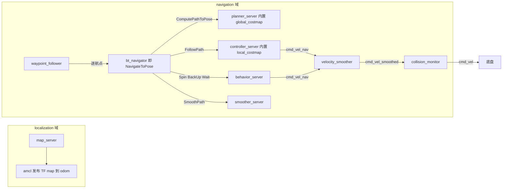
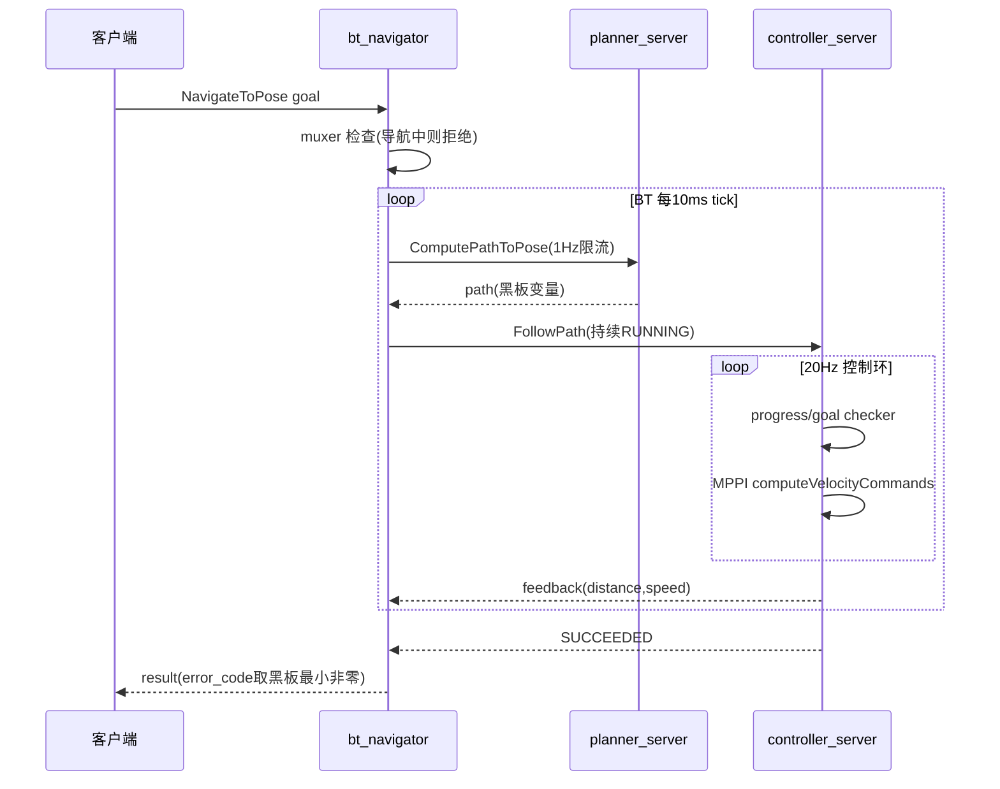
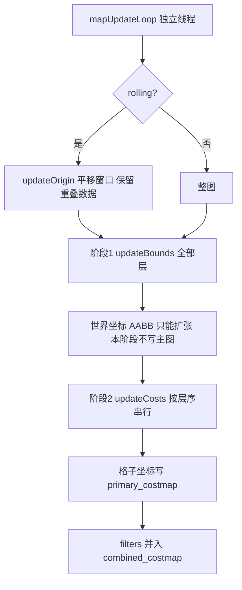
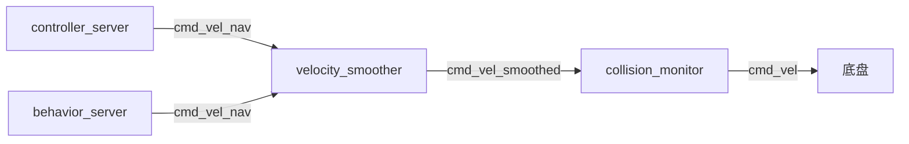

# Nav2 (Jazzy) 深度研究完全指南

> 目标读者：ros2_amr_framework 维护者（自研导航栈，需借鉴而非移植）
> 版本基线：**nav2 1.3.12 @ Jazzy**（/opt/ros/jazzy 本地二进制验证；docs.nav2.org 默认展示 latest，与本基线有实质差异，见 §5.4）
> 难度等级：原理篇为中高；其余章节中级
> 研究方法：五路并行（运行时拓扑 / 源码契约 / 设计理念+论文 / 本框架对照 / 调试工具链），结论标注证据等级

**证据等级标记**：
- 【源码】= 本地 /opt/ros/jazzy headers / BT XML / launch / params / action 定义实读
- 【官方】= docs.nav2.org 官方文档（文档源码仓 rst 原文）
- 【论文】= arXiv 一手论文（Marathon 2 / maintainers survey / SMAC / RPP）
- 【社区】= GitHub issues / discussions
- 【未确认】= 无法从一手材料核实，明示存疑

---

## 0. 研究目标与成功指标（接口4-0）

| 项 | 内容 |
|---|---|
| 核心问题 | Nav2 的每个架构决策"为什么这样设计、备选是什么、付出什么代价"，以及 ros2_amr_framework 应借鉴什么、明确不抄什么 |
| 预期输出 | 本文档 + 可评审的借鉴决策清单（§4.1，每条可追溯到证据） |
| 成功标准 | ① 每个论断有证据等级标记；② 借鉴清单映射到本框架具体模块；③ 区分"官方明说"与"社区经验"；④ 未核实项显式列出（附录D） |
| 约束 | 本地仅二进制安装（.cpp 不可见），涉及方法体内部流程处标注推断 |
| 风险与缓解 | 网络资料可能混入 latest 版内容 -> 已用本地 1.3.12 二进制逐一甄别（§5.4） |

---

## 目录

- 第1章 Nav2 是什么（入门篇）
- 第2章 架构决策与内部机制（原理篇）
- 第3章 失效处理与已知坑（故障篇）
- 第4章 对 ros2_amr_framework 的借鉴（最佳实践篇）
- 第5章 调试排查实战（工具篇）
- 附录A 契约速查 / 附录B 参数面全景 / 附录C 来源索引 / 附录D 未确认清单

---

## 第1章 Nav2 是什么（入门篇）

### 1.1 全景

Nav2 是 ROS2 官方导航栈：**一个 BT 编排器（bt_navigator）驱动一组异步 action server（规划/控制/恢复/平滑/航点/路线/对接），每个 server 内部 pluginlib 加载可替换算法插件，全部节点 lifecycle 化并由 lifecycle_manager 按序激活**。【源码】



要点纠偏（很多中文资料已过时）：
- **Jazzy 默认控制器是 MPPI**（`nav2_mppi_controller::MPPIController`），不是 DWB——Humble 是 DWB，Jazzy 起换了【源码：nav2_params.yaml 对比 humble/jazzy 分支】【官方：maintainers survey 明言要换】
- **默认规划器 NavFn 走 Dijkstra**（`use_astar: false`）【源码：nav2_params.yaml L283】
- `use_composition` 默认 True，容器是 `component_container_isolated`（每组件独占线程），不是 `component_container_mt`【源码：bringup_launch.py L126-155】

### 1.2 与 ros2_amr_framework 的粗对照

| Nav2 概念 | 本框架对应物 | 状态 |
|---|---|---|
| bt_navigator + BT | 无（decision_node 感知驱动规划循环 + patrol_3c.py 脚本编排） | ❌ 空缺 |
| planner_server + SmacPlanner | AStarPlanner（domain/planning/astar_planner.hpp，注释自对标） | ✅ 简化版 |
| costmap_2d 分层 | scan_to_grid + grid_updater 单层（注释自对标 ObstacleLayer） | ⚠️ 无静态层/无层合成 |
| controller_server + RPP/MPPI | PurePursuit + VFH（vfh 默认关） | ✅ 简化版 |
| collision_monitor | CollisionGuard | ✅ 各自实现 |
| velocity_smoother | VelocitySmoother | ✅ |
| behavior_server（Spin/BackUp/Wait） | 无（死锁评审有意排除，见 §4.4） | ❌ 有意空缺 |
| NavigateToPose action | MoveToPose action | ✅ 语义子集 |
| lifecycle_manager + bond | health_monitor 心跳 + ChangeState 重启 | ⚠️ 纳管方式不统一 |
| waypoint_follower | patrol_3c.py 三点轮询 | ⚠️ 脚本级 |

### 1.3 一个导航任务的完整旅程



关键语义：ComputePathToPose 以 1Hz 刷新黑板 `{path}`，FollowPath 全程 RUNNING 消费最新路径——**"边走边重规划"不是重开 action，而是 PipelineSequence 让前序节点在后续节点 RUNNING 时继续被 tick**。【源码：navigate_to_pose_w_replanning_and_recovery.xml + pipeline_sequence.hpp】

---

## 第2章 架构决策与内部机制（原理篇）

### 2.1 决策一：BT 编排，而不是 FSM

**官方理由**【官方：concepts 页】：
1. FSM 几十状态数百转换难维护；BT 原语（kick、go_to_ball）跨行为复用
2. **可形式化验证**：官方原话——"应用逻辑集中在 BT、任务服务器互相独立、只经树传数据，allows for formal analysis"
3. BehaviorTree.CPP 的选型原因是支持 subtree 加载：Nav2 整棵树可作为一个节点嵌入更大任务级 BT【论文：Marathon 2】

**备选方案官方明说**：HFSM 也行，选 BT 一半是"popularity + user demand"（社区生态原因，非纯技术压倒性优势）；官方甚至说将来提供 hfsm_navigator "not difficult"。【官方】

**代价**：BT 节点调 remote server 有跨进程序列化与 action 往返延迟；官方在 Kilted 加 intra-process 选项对冲。【官方：migration/Kilted】

**Nav2 特有的三个控制节点是架构落点**【官方+源码】：
- `PipelineSequence`：后续子节点 RUNNING 时回头重 tick 前面兄弟——流水线重规划的结构基础
- `RecoveryNode`：双子女（任务+恢复），失败进恢复、恢复成功重试，上限 number_of_retries
- `RoundRobin`：轮转 tick 恢复动作，成功即返回、失败换下一个

### 2.2 决策二：bt_navigator 用 action 调 server，而不是函数调用

**换来什么**【官方+论文：Marathon 2 III.B】：
1. **核/进程隔离**：长耗时 server 跑在其他核，任意 ROS2 客户端语言可实现
2. **成本共享**：planner/controller 各自托管 costmap（"costly to duplicate"），behavior server 订阅 controller 的 local costmap 而非自建
3. **抢占/取消/重规划统一收口**：Marathon 2 原话"This server also processes cancellation, preemption, or new information requests"——抢占是 action 层一等公民，函数调用做不到
4. **别名机制**：BT 里写 `FollowPath`/`GridBased`（任务类别名）而非算法名，server 端映射到 pluginlib 算法，支持运行时经 selector topic 换算法

**代价**：序列化开销（官方 intra-process 对冲）；调试链路变长（一跳 action 一层日志）。

**抢占语义三层**【官方】：bt_navigator 的 `allow_navigator_preemption`（跨 navigator 交接，默认 false）；BT 层 `GoalUpdated` + ReactiveFallback（新目标立刻打断恢复子树）；action 节点 halt 即发 cancel（`default_cancel_timeout` 50ms）。

### 2.3 决策三：服务器-插件架构（nav2_core 契约）

**分层铁律：插件无 ROS 感知**。接口只暴露算法语义，action server/tf/costmap 线程全在 server 层；插件 configure 拿 `LifecycleNode::WeakPtr` 防所有权环。【源码：nav2_core/*.hpp】

核心契约表（完整签名见附录A）：

| 接口 | 核心方法 | 失败表达 | 特色设计 |
|---|---|---|---|
| Controller | `computeVelocityCommands(pose, velocity, goal_checker*)` | 抛 ControllerException 族 | goal_checker 裸指针传入，控制器自行查容差做收尾减速 |
| GlobalPlanner | `createPlan(start, goal, cancel_checker)` | 抛 PlannerException 族 | **取消用注入式 `std::function<bool()>`**，插件在自然检查点自灭，不强杀线程 |
| GoalChecker | `isGoalReached(query, goal, velocity)` | bool | 坐标系对齐责任在调用方（注释明写 presumed same frame） |
| ProgressChecker | `check(current_pose&)` | bool | "机器人在动但没在前进"的正式入口，server 转 FailedToMakeProgress |
| Smoother | `smooth(path&, max_time)` | **双通道**：bool=被时间打断，真错误抛异常 | 坑：调用方要检查两处 |
| Behavior | `onRun` + `onCycleUpdate` | **ResultStatus{Status, error_code}**，异常被完全取代 | 模板方法：execute() 固定主循环 |

**错误传递三通道**（跨层降维设计，最值得抄）：
1. 进程内：异常族**按失败原因命名**（StartOccupied / PatienceExceeded / FailedToMakeProgress...），上层 recovery 可精确匹配原因
2. 跨 action 边界：异常被 server 捕获，翻译成 `uint16 error_code` 分段编号（100=FollowPath / 200-300=规划 / 500=smoother / 700+=行为 / 901=dock）
3. BT 层：黑板变量（`follow_path_error_code` 等）经 `error_code_names` 参数声明，bt_navigator 取**最小非零**冒泡到 NavigateToPose result【源码：bt_action_server_impl.hpp 358-388】

### 2.4 决策四：costmap 两阶段更新



- **两阶段动机**：先谈判所有层脏区并集，再按层序串行写入——后写层（inflation）能看到前写层（obstacle）的边界需求。做多源融合地图的通用范式【源码：layer.hpp 92-112，注释引 Lu & IROS 2014】
- **合并策略家族**（protected 内化）：updateWithTrueOverwrite（静态层用）/ Overwrite / Max / MaxWithoutUnknownOverwrite / Addition——层间覆盖语义插件自选【源码：costmap_layer.hpp 96-158】
- **双主图**：primary（plugins 写）+ combined（再并 filters），隔离 costmap filter 对插件层的干扰【源码：layered_costmap.hpp 214-219】
- **为什么还用 2D 网格不上四叉树/3D**：inflation 卷积后四叉树"fail to recover substantial memory benefits"，查询非常数时间；高维信息由层内部维护（voxel 3D 体素）再归约到 2D【论文：survey 第 V 节】
- **inflation 语义**：`cost_scaling_factor` 是指数衰减系数 e^(-factor·d)——**值越大衰减越快、代价只在近处显著；值越小势场越平缓**（社区常见误解方向相反）。官方 tuning 观点：inflation 的价值是全图平滑势场，不是贴墙窄圈；通道场景应让势场铺满通道【官方：tuning】
- 保留值：254=lethal，253=内切 lethal（圆近似换一阶碰撞检查速度），255=unknown【论文：survey】

### 2.5 决策五：cmd_vel 三级流水线与安全外环



- **恢复行为也过平滑器**（behavior_server 的 cmd_vel 同样 remap 到 cmd_vel_nav）——任何速度指令都有加速度约束【源码：navigation_launch.py L181】
- **collision_monitor 是唯一碰真实底盘话题的 nav2 节点**。官方定位："bypassing the costmap and trajectory planners"的急停级防护，四模型 stop/slowdown/limit/approach（approach 保持"永远距碰撞 time_before_collision 秒"）；明说**不提供硬实时安全认证**，等价于用普通传感器复刻安全扫描仪行为【官方：collision_monitor 配置页】。在 odom 系工作（不用 map，避免定位跳变打进安全回路）【源码：nav2_params.yaml L374-377】
- 排查"机器人不动"要按这条链逐段查，不是只看 controller 输出

### 2.6 决策六：全组件 lifecycle 化 + bond

- managed nodes 换来"启动/关停行为确定性"：on_configure 做参数/网络/内存分配，on_activate 才处理数据【官方】
- **bond 心跳**（0.25s 周期 / 4s 超时）：任一 server 崩溃 -> **整个系统按序 deactive**。把"部分故障"升级为"全系统安全停止"的保守设计【官方：configuring-lifecycle】
- **两个独立管理域**（localization / navigation）并行 autostart，**没有跨域激活顺序保证**——navigation 只靠 timeout 等依赖就绪；真正的隐式依赖是 static_layer 等 map_server 的 transient_local 地图、controller 等 amcl 的 TF【源码：navigation_launch.py / localization_launch.py】
- costmap Layer 的生命周期是**两段式**（activate/deactivate + onInitialize），与 nav2_core 插件**四段式**（configure/activate/deactivate/cleanup）不一致——插件生命周期两套标准是历史债【源码：layer.hpp vs controller.hpp】

### 2.7 控制器/规划器谱系与选型

**控制器官方分类学**【论文：survey】：DWB=反应式，RPP=几何，Graceful=控制律，MPPI/TEB=预测式。

| | 本质 | 避障 | 频率上限【论文】 | 官方定位 |
|---|---|---|---|---|
| DWB | 动态窗口采样+critic | 主动绕 | 250Hz | Humble 前默认；maintainer 明言"参数高度耦合难调"要被换 |
| RPP | 自适应 PP + 曲率/近障减速 | **不绕**，遇阻停等重规划 | >4000Hz | 精确路径跟踪、工业走廊；Ackermann 需配可行规划器 |
| Graceful | 阿基米德螺旋控制律 | 前向仿真校验 | 1800Hz | 差速平滑跟踪、单目标位姿直接收敛 |
| MPPI | 采样式 MPC（critic 全插件化，不必可微不必凸） | 预测式绕障+**预测式倒车脱困** | 125Hz | **Jazzy 起默认**；动态环境首选 |

演进逻辑：DWB 输在调参（survey 原话"Many deploy un-tuned parameters and remark at poor robot behavior"）；RPP/Graceful 是"不绕障的精确跟踪器"（工业场景沿批准走廊行驶，安全至上）；MPPI 用算力换行为智能——survey 实测 MPPI"rarely requires active recovery behaviors to assist getting out of local minima"。粘合剂 RotationShimController 专治"路径初始朝向偏差大"（起步甩头）。

**规划器**【论文：survey Table I + SMAC 论文】：

| | 可行性 | 实测 | 适用 |
|---|---|---|---|
| NavFn | 全向点机器人 | 61ms/52.25m（最快最长） | 小圆差速车默认 |
| Theta* (Lazy-P) | 全向 | 94ms/50.28m（最短最慢） | 长直走廊、any-angle |
| Smac 2D-A* | 全向 | 89ms/49.65m | 车队行为一致 |
| Smac Hybrid-A* | 非完整可行+全形状足迹 | 39ms（仓库实测 290ms） | Ackermann/腿式/大型非圆 |
| Smac Lattice | 可行+任意运动模型 | 39ms/50.51m | 新颖底盘；与 Hybrid-A* 差 <0.5%，按运动模型选 |

SMAC 的 Cost-Aware 变体用整个 cost grid 引导搜索（非二值碰撞），天然尊重 keepout 约束并远离障碍【论文：SMAC】。

**route server（Jazzy 新增）**：预定义导航图替代/增强自由空间规划。工业场景"机器人应在已知车道内**确定性**规划而非自由漫游"。核心架构两种：route 输出密集 path 直接给 controller（完全替代 planner）；或 route 输出稀疏节点给 planner、planner 只对未来局部做自由空间规划【官方：nav2_route README】。

### 2.8 C++ 设计模式清单（自研参考）

1. **模板方法/NVI**：Layer::initialize 非虚 public -> protected onInitialize（插件拿不到半初始化上下文）；BehaviorTreeNavigator 的 on_configure 是 final 先做基础设施再调用户 configure【源码】
2. **插件容器两种**：`unordered_map<string, Ptr>`（运行时按 id 选：controller/planner）vs `vector<UniquePtr>`（固定清单：navigator/behavior）【源码】
3. **Muxer 互斥守卫**：NavigatorMuxer 字符串空/非空做状态+锁内双检；并发导航**只拒不排队**【源码：behavior_tree_navigator.hpp 46-107】
4. **每 BT 节点专属 callback group + mini executor**：BT 单线程 tick，action 回调不能进主 executor 否则死锁——任何"回调驱动的库被同步 tick 循环调用"的场景都需要此模式【源码：bt_action_node.hpp 55-58】
5. **预抢占双槽**（current/pending handle）：新 goal 到达不 cancel 旧的，进 pending 槽由 worker 在安全点切换【源码：simple_action_server.hpp 200-234】
6. **模板基类不能进容器的事后补救**：NavigatorBase 非虚层就是为让模板子类进同一 vector——设计之初就该规划非虚接口层【源码：注释原文】
7. **非 pimpl**：抽象靠纯虚接口，ABI 兼容交给 pluginlib

---

## 第3章 失效处理与已知坑（故障篇）

### 3.1 Nav2 的双层恢复哲学

**第一层：上下文恢复（contextual recovery）**。失败发生在哪个语境就恢复哪个环境表征：ComputePathToPose 失败 -> 清 **global** costmap；FollowPath 失败 -> 清 **local** costmap（规划器用全局图、控制器用局部图，被假障碍污染的来源不同）。新版加了 `WouldAPlannerRecoveryHelp` / `WouldAControllerRecoveryHelp` 按 **error_code 判断该恢复是否有意义**（TF 错误清图无用，直接放行失败）。【官方：BT Walkthrough】

**第二层：系统级恢复**。Navigation 子树整体失败 -> ReactiveFallback（GoalUpdated 在前随时被新目标打断）-> RoundRobin 顺序：清双图 -> Spin 1.57rad -> Wait 5s -> BackUp 0.30m。顺序逻辑 Marathon 2 原话"ordered from conservative to aggressive actions"，每成功一个就回主任务重试。顶层 RecoveryNode number_of_retries=6。【源码+官方】

**默认树完整结构**（本地 navigate_to_pose_w_replanning_and_recovery.xml 逐节点）：

```
RecoveryNode "NavigateRecovery" number_of_retries=6
├─ PipelineSequence "NavigateWithReplanning"
│   ├─ ControllerSelector (default=FollowPath, topic 可运行时切换)
│   ├─ PlannerSelector (default=GridBased)
│   ├─ RateController hz=1.0                          ← 1Hz 重规划闸门
│   │   └─ RecoveryNode "ComputePathToPose" retries=1
│   │       ├─ ComputePathToPose (error_code -> 黑板)
│   │       └─ [恢复] WouldAPlannerRecoveryHelp + ClearEntireCostmap(global)
│   └─ RecoveryNode "FollowPath" retries=1
│       ├─ FollowPath (error_code -> 黑板)
│       └─ [恢复] WouldAControllerRecoveryHelp + ClearEntireCostmap(local)
└─ [全局恢复] Fallback(WouldAController/PlannerRecoveryHelp)
    └─ ReactiveFallback
        ├─ GoalUpdated                                  ← 新目标立刻放弃恢复
        └─ RoundRobin "RecoveryActions"
            ├─ 清 local + 清 global
            ├─ Spin 1.57
            ├─ Wait 5.0
            └─ BackUp 0.30m @ 0.15m/s
```

### 3.2 恢复行为的实测证据（Marathon 2）

- **22.8 小时 37.4 英里（约 60km），0 碰撞、0 急停、0 任务失败**，平均 0.37 m/s【论文】
- 共触发 **168 次恢复（4.3 次/英里）**；论文特别声明"triggering recovery behaviors is **not** generally a poor-performance indicator since it is part of a fault-tolerant system"【论文】
- 恢复两大真实诱因：① 拥挤导致 local costmap 被占满（clear costmap / wait 解决）；② 长走廊重复纹理 AMCL 置信度下降——**spin 恢复帮 AMCL 重新定位**（recovery 树里放 spin 的官方理由）【论文】

> 对本框架的启示：恢复行为不是"性能差的补丁"而是容错系统的一部分；且 spin 的价值一半在定位，不在脱困。

### 3.3 已知坑（社区高频 + 官方明示）

**用法/理解类**：
1. **BT recovery 嵌套误解**（至今高频）：RecoveryNode 只有两子女；系统级四种恢复是 RoundRobin 每轮失败后 tick 下一个，不是依次全跑。仍有 issue 要求"重置重试计数器"（#6236）【社区】
2. **local costmap 必须 odom 系 + rolling**：用 map 系会让 AMCL 跳变直接打进控制回路（经典事故）；RViz Fixed Frame=map 时看 local costmap 错位是定位漂移量的假象【官方+社区】
3. **keepout + SMAC 必须补 inflation**：filters 不经过 inflation，可行规划器只做中心点预筛——官方原话"planner will not respect the Keepout Zone on its extremities"【官方：keepout_filter 页】
4. **cost_scaling_factor 方向误解**：越大衰减越快、势场越窄（不是越安全）【社区】
5. **近似目标不重规划保护**：feasible planner 下小半径内重规划会因状态估计漂移产生"looping behaviors"，官方 IsGoalNearby 在 4m 内且旧路径有效时跳过重规划【官方】

**实现/环境类**：
6. **插件未捕获异常穿透 worker**：SimpleActionServer 的 catch 是兜底（terminate_all），异常会终止整个 goal 而非单周期，有状态插件（MPPI rollout）丢状态【源码推断】
7. **bond 断则全栈拉停**：默认行为，节点崩溃 -> 整个系统 deactive；需调 bond_timeout / attempt_respawn_reconnection【官方】
8. **composition 模式下 backward_ros 不工作**：拿崩溃栈要 use_composition:=False 重跑【官方：get_backtrace 教程】
9. **Jazzy 行为变化：TF 断则 costmap activation 直接失败**（Iron 是无限等待）——白图在 Jazzy 常表现为 lifecycle 卡住【官方：migration/Jazzy】
10. **multithreaded executor**：Nav2 模型是每 server 一进程、内部单线程 executor 为默认；多线程是优化课题（官方 SoC 立项过）【官方+社区】
11. **上游不一致/笔误**（本研读到）：两棵默认树 BackUp 黑板变量名不一致（backup_code_id vs backup_error_code）；local_costmap 定义了 static_layer 但不在 plugins 列表（死配置）；GoalChecker::Reset() 大写 vs 其它 reset()；InvalidPath 在 controller/smoother 两命名空间重名不同型【源码】

---

## 第4章 对 ros2_amr_framework 的借鉴（最佳实践篇）

### 4.1 借鉴决策总表

| # | 借鉴点 | 建议 | 证据 | 映射模块 |
|---|---|---|---|---|
| 1 | 错误码三通道降维（异常->error_code->黑板汇聚） | **抄** | 【源码】 | MoveToPose action 加 error_code 枚举段 |
| 2 | 异常族按失败原因命名（非按组件） | **抄** | 【源码】 | domain 层异常体系（现为 bool/abort 粗粒度） |
| 3 | cancel 用注入式 std::function<bool()> | **抄** | 【源码】 | A* 长规划 + motor 控制环的取消语义 |
| 4 | goal checker / progress checker 从算法剥离 | **抄** | 【源码】 | 到点判定目前内嵌 PurePursuit |
| 5 | 两阶段地图更新（谈判脏区->串行写入） | **抄思路** | 【源码】 | 死锁评审 C4（object 层每帧重建）落地时用 |
| 6 | cmd_vel 单出口 + 安全闸在最后一级 | **已同构，补对齐** | 【源码】 | CollisionGuard 已在 smoother 后，验证恢复路径也过闸 |
| 7 | 上下文恢复 + error_code 判定恢复是否有意义 | **候选**（见 4.4 讨论） | 【官方+论文】 | 当前唯一恢复=abort->重规划 |
| 8 | 分层 costmap / static layer | **补 static 消费** | 【源码】 | 建图产物 amr_map.pgm 与规划输入脱节（最大断链） |
| 9 | BT 全家桶 | **暂不抄** | 【官方】 | 编排复杂度当前不值；见 4.3 |
| 10 | action 层层嵌套的跨进程架构 | **不抄** | 【官方】 | 本框架 compute_container 同进程，intra-process 更直接 |
| 11 | 生命周期两套标准（costmap 两段 vs core 四段） | **避坑** | 【源码】 | 自研统一一套 onConfigure/onActivate |
| 12 | NavigatorMuxer 只拒不排队 | **避坑** | 【源码】 | 若做任务队列，直接做排队+抢占语义 |

### 4.2 明确值得抄的三个（展开）

**a. 错误码通道**。本框架 MoveToPose 的 Result 只有 `reached` bool——失败原因（规划失败？跟踪超差？guard 压死？anti-deadlock abort？）全靠日志反推。Nav2 的做法：domain 异常按原因细分 -> server 翻译成分段 uint16 -> 顶层汇聚。工作量小（一个枚举+翻译点），收益是**故障归因从"翻日志"变"读码"**——与本仓调试归因规范直接互补。

**b. 注入式 cancel_checker**。A* 规划和 20Hz 控制环的取消目前靠标志位轮询散落各处；`createPlan(start, goal, std::function<bool()>)` 把取消点收进算法自然检查点，server 侧不必强杀线程。

**c. progress checker 的语义**。"机器人在动但没在前进"（转圈、顶墙滑动）与"完全不动"是不同故障，本框架 anti-deadlock 只判后者（4mm/s 边界）。SimpleProgressChecker 的 radius+time_allowance 判据是前者的标准答案，且它是**让 FollowPath 失败从而触发上层恢复的正式入口**——本框架里等价物是 guard 计时 abort，语义相同但埋在 motor_ctrl 内部。

### 4.3 明确不抄的

- **action 层层嵌套**：Nav2 为多核利用+语言无关+跨进程抢占付出序列化代价；本框架 decision/motor 同进程同容器，函数/接口调用 + intra_process 是更优解。Nav2 自己也在 Kilted 加 intra-process 对冲，方向一致
- **BT 全家桶**：官方选 BT 一半是"user demand"（生态原因）；本框架任务拓扑（3 机台轮询）用 70 行 Python 状态机表达力足够。**引入 BT 的触发条件应是"编排逻辑的状态数开始膨胀"而非提前**——与死锁评审"证据不足前不加状态"同构
- **pluginlib 动态加载**：本框架 HAL 层静态 Registry 已实现"加传感器零改框架"，编译期注册的类型安全优于运行时 so 加载，当前规模无需 pluginlib

### 4.4 需要用户裁决的哲学冲突：要不要恢复行为

死锁评审（20260817）当时**有意排除** decision 侧恢复行为（微退/重试），理由"证据不足前不加状态"。Nav2 的对照证据：

| 维度 | 本框架（被动恢复） | Nav2（主动恢复） |
|---|---|---|
| 脱困手段 | guard 计时 abort -> 下周期 A* 重规划 | 清图/Spin/Wait/BackUp 渐进 |
| 理论风险 | 恢复行为本身制造新事故（当时顾虑） | 恢复行为可能撞人/撞物 |
| 实测证据 | 穿货架两起事故在**无恢复行为**下发生（90a1a86 前后） | 60km 0 碰撞，4.3 次恢复/英里，恢复=容错系统一部分 |
| 定位耦合 | 无 | spin 半个价值在帮 AMCL 重定位（本框架用 mock_amcl 暂无此需求） |

**反问而非结论**：当时的"证据不足"是否已被两起穿货架事故改变？穿货架根因是 scan 扇区失明（已用虚拟近障封死区治标），即使如此——若 A* 重规划连续 N 次失败（真堵塞），本框架现在的行为是什么？（答：无限重试循环，patrol 无超时。）Nav2 的答案是 6 次后向客户端报失败。**至少"有限重试+上报失败"是两边都同意的最小公倍数**，BackUp/Spin 可以继续等证据。

### 4.5 自研陷阱规避清单（从 Nav2 的债学来的）

1. 接口命名先定规约（Nav2 的 Reset/reset 漂移、InvalidPath 重名是十年债）
2. 状态量收进基类或加 invariant 断言（Nav2 Layer::current_ 由子类自管，有 TODO 认账）
3. 入参统一 Stamped（Nav2 computeVelocityCommands 入参 velocity 裸 Twist 无法校验新鲜度）
4. bool 双语义拆成 enum（smooth() 的"完成 vs 被打断"）
5. rejection 语义收一个点（Nav2 handle_goal 恒 ACCEPT，检查分散两处）
6. 模板类先规划非虚接口层（NavigatorBase 事后打补丁）
7. package.xml 声明实际运行依赖（本框架 launch 用了 nav2_map_server/amcl/lifecycle_manager 但 package.xml 无 exec_depend——D 路发现，移植/CI 会踩）

---

## 第5章 调试排查实战（工具篇）

### 5.1 诊断决策树（按数据流上游往下游）

```
导航失败
├─ 1 栈起没起来？   ros2 lifecycle get /bt_navigator（卡 unconfigured/inactive -> 查 manager 日志、bond）
├─ 2 TF 链完整？    tf2_echo map odom / tf2_monitor（Jazzy: TF 断 = costmap activation 直接失败）
├─ 3 定位/地图对？  /map 有发布？AMCL 收敛？
├─ 4 costmap 对？   RViz 订阅 costmap（Color Scheme 必须设 costmap 才见 inflation 渐变）
├─ 5 规划器出路径？ ros2 action send_goal /compute_path_to_pose ... --feedback
├─ 6 控制器跟路径？ /cmd_vel 有输出？FollowPath feedback 的 distance_to_goal 收敛？
├─ 7 BT 编排对？    Groot2 实时看状态转移 / /behavior_tree_log
└─ 8 性能？         grep "missed its desired rate" -> use_realtime_priority / 降频 / RMW
```

**分层二分法**：ComputePathToPose 成功 + FollowPath 失败 = 控制器/局部图问题；ComputePathToPose 就失败 = 全局图/规划器问题。

### 5.2 工具箱速查

- **BT**：Groot2 live 模式（Jazzy 1.3.12 已含实现但默认关，需手动加 `enable_groot_monitoring: true` + `groot_server_port: 1667`）；`ros2 topic echo /behavior_tree_log`（JSON 状态转移流）；离线编辑导入 `/opt/ros/jazzy/share/nav2_behavior_tree/nav2_tree_nodes.xml`
- **失败先读 error_code**（比猜日志快）：104 PATIENCE_EXCEEDED / 105 FAILED_TO_MAKE_PROGRESS / 106 NO_VALID_CONTROL / 107 CONTROLLER_TIMED_OUT / 203-206 起终点出图或被占 / 208 NO_VALID_PATH
- **CLI 手测**：`ros2 action send_goal /navigate_to_pose nav2_msgs/action/NavigateToPose "{...}" --feedback`；单测规划器/控制器见决策树 5/6 步
- **脚本化回归**：nav2_simple_commander 的 BasicNavigator（`waitUntilNav2Active` 替代人工确认 lifecycle；9 个示例在 /opt/ros/jazzy/lib/nav2_simple_commander/）
- **无头回环仿真**：`tb3_loopback_simulation.launch.py`（需另装 ros-jazzy-nav2-loopback-sim，本机未装）——验证 BT/参数/API/CI，**不能**验证避障调参（cmd_vel 回环成 odom+TF，无物理噪声）
- **崩溃栈**：backward_ros 已内置自动打栈，但 composition 模式失效 -> `use_composition:=False` 重跑
- **软实时**：`use_realtime_priority: true`（rtprio 90，需 limits.conf 加 rtprio 99）
- **性能基线**（官方 2025-12 TB4 仿真）：Zenoh CPU 4.5% vs CycloneDDS 18.3% vs FastDDS 6.8%

### 5.3 故障征兆对照表

| 现象 | 最可能原因 | 验证 |
|---|---|---|
| 发 goal 完全无响应 | 栈未 active（autostart 未开） | `ros2 lifecycle get /bt_navigator` |
| costmap 全白/空 | 启动顺序错（传感器/TF 未就绪先起 Nav2） | `ros2 topic hz /scan`；按 描述->SLAM->Nav2 顺序起 |
| costmap activation 直接失败 | TF 断（Jazzy 行为变化） | `tf2_monitor` |
| costmap 与障碍错位 | RViz Fixed Frame 与 local costmap odom 系不符 | `ros2 param get ... global_frame` |
| 有 plan 无 cmd_vel | goal checker 提前判达 / cmd_vel 重映射链断 | `ros2 topic echo /cmd_vel`；error_code 106/107 |
| 路径贴墙 | inflation 势场没铺开 | costmap 配色目视；调大 inflation_radius |
| 起步甩头 | 初始朝向偏差大 | Rotation Shim Controller |
| 反复进 recovery | 跟踪失效 | feedback 的 number_of_recoveries；error_code 104/105 |
| 节点崩则全栈停 | bond 断裂（默认行为） | manager 日志；调 bond_timeout |
| 崩溃只见 exit code | composition 下 backward_ros 失效 | use_composition:=False 重跑 |

### 5.4 Jazzy vs latest 文档甄别（本机 1.3.12）

| latest 文档内容 | Jazzy 实况 |
|---|---|
| `error_code_name_prefixes` | 用 `error_code_names` |
| FollowPath feedback 是 nav2_msgs/Speed 复合结构 | 是 `distance_to_goal` + `speed` 两个 float32 |
| Route Server / NonblockingSequence / path_handler | L-turtle 内容 |
| `enable_stamped_cmd_vel` 默认 true（Kilted+） | Jazzy 默认 false |
| Groot2 监控标 Kilted | Jazzy 维护版已含（默认关） |

---

## 附录A 契约速查（action 错误码分段）

| 段位 | Action | 关键码 |
|---|---|---|
| 顶层 | NavigateToPose / NavigateThroughPoses | 仅 NONE=0（细分码下沉） |
| 100-107 | FollowPath | 102 TF / 103 INVALID_PATH / 104 PATIENCE / 105 NO_PROGRESS / 106 NO_VALID_CONTROL / 107 TIMEOUT |
| 200-208 | ComputePathToPose | 203/204 出图 / 205/206 被占 / 207 超时 / 208 无路径 |
| 300-309 | ComputePathThroughPoses | +309 无途经点 |
| 400-407 | ComputeRoute | 401 无图 / 402 无路线 |
| 500-505 | SmoothPath | was_completed 区分部分平滑 |
| 600 | FollowWaypoints | result 含 MissedWaypoint[] |
| 700/710/720/730 | Spin / BackUp / DriveOnHeading / AssistedTeleop | 713 COLLISION_AHEAD 等 |
| 901-906 | DockRobot | feedback 带 5 态状态机 |

关键 srv：ManageLifecycleNodes（manager 总开关）/ LoadMap / ClearEntireCostmap（BT 叶子调用的就是它）/ IsPathValid / GetCostmap / SpeedLimit.msg（costmap filter 与 route 的限速汇点）。

## 附录B 参数面全景（判别法）

凡 `<instance>: plugin: "<类名>"` + 顶层 `<xxx>_plugins: [实例名]` 是 **plugin 声明**；其余（频率/容差/权重/frame/topic）是调优参数。Jazzy 默认面：controller 20Hz + MPPI(56 步长/2000 batch/DiffDrive) + SimpleProgress(0.5m/10s) + SimpleGoal(0.25m/0.25rad)；local_costmap 3x3m rolling odom 系 voxel+inflation(0.70/3.0)；global_costmap 整图 map 系 static+obstacle+inflation；planner NavFn Dijkstra tolerance 0.5；behavior 周期 10Hz simulate_ahead 2.0s；velocity_smoother 20Hz OPEN_LOOP max_accel 2.5；collision_monitor approach 模式 time_before_collision 1.2s；docking 50Hz k_phi 3.0。

## 附录C 来源索引

- 官方概念：<https://docs.nav2.org/concepts/> | BT 精读：<https://docs.nav2.org/behavior_trees/overview/detailed_behavior_tree_walkthrough/>
- Marathon 2 (IROS 2020)：<https://arxiv.org/abs/2003.00368> | maintainers survey (RAS 2023)：<https://arxiv.org/pdf/2307.15236.pdf>
- SMAC：<https://arxiv.org/abs/2401.13078> | RPP：<https://arxiv.org/abs/2305.20026>
- 迁移指南：<https://docs.nav2.org/migration/Jazzy/> <https://docs.nav2.org/migration/Kilted/>
- route server：<https://github.com/ros-navigation/navigation2/tree/main/nav2_route>
- 本地一手：/opt/ros/jazzy/include/nav2_core 等 26 包 headers、nav2_bringup launch+params、nav2_bt_navigator behavior_trees、nav2_msgs action/srv/msg

## 附录D 未确认清单（不编造）

1. bt_navigator 代码内 default_bt_xml 默认路径（仅 yaml 注释陈述，二进制 strip）
2. lifecycle_manager bond 参数默认值（配置中不可见；官方文档值 4.0/0.25/10.0 未在本机二进制核验）
3. velocity_smoother 输出话题包内默认名（由 collision_monitor 订阅名反推，链路闭合一致）
4. Groot2 在 Jazzy 的监控成熟度（符号存在，行为未实测）
5. "opportunistic planning" 术语：官方全仓 grep 零命中，非 Nav2 术语（最近似概念是 RateController 周期重规划）
6. 涉及 .cpp 方法体内部流程的时序（附录标注"推断"处）

---

**文档版本**：1.0（2026-08-20）
**研究分工**：运行时拓扑 / 源码契约 / 设计理念+论文 / 本框架对照 / 调试工具链 五路并行，主线程交叉汇总
**下一步**：§4.4 的哲学冲突需用户裁决；§4.1 总表确认后可转立项
