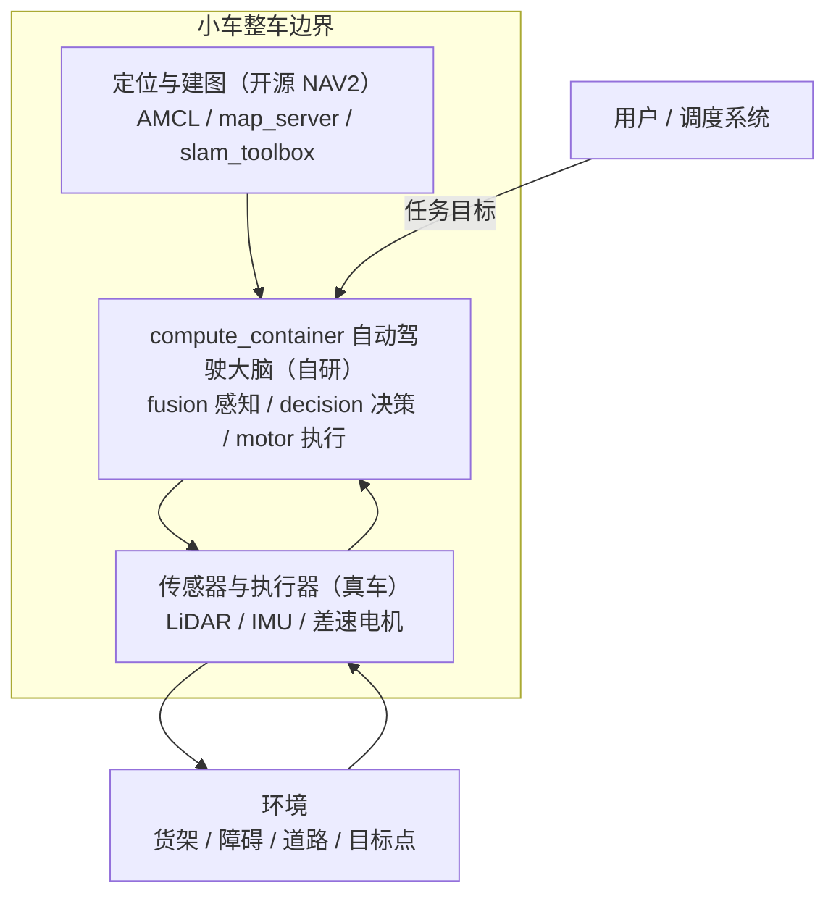
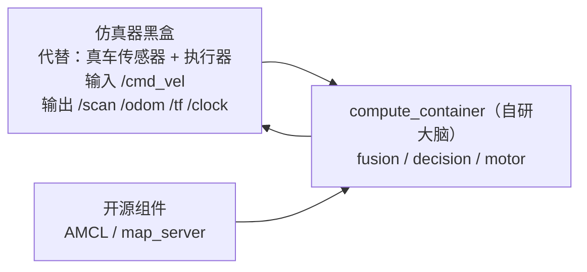
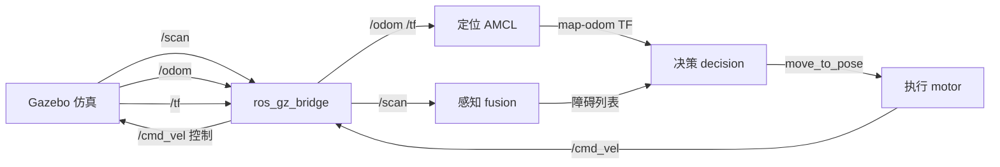
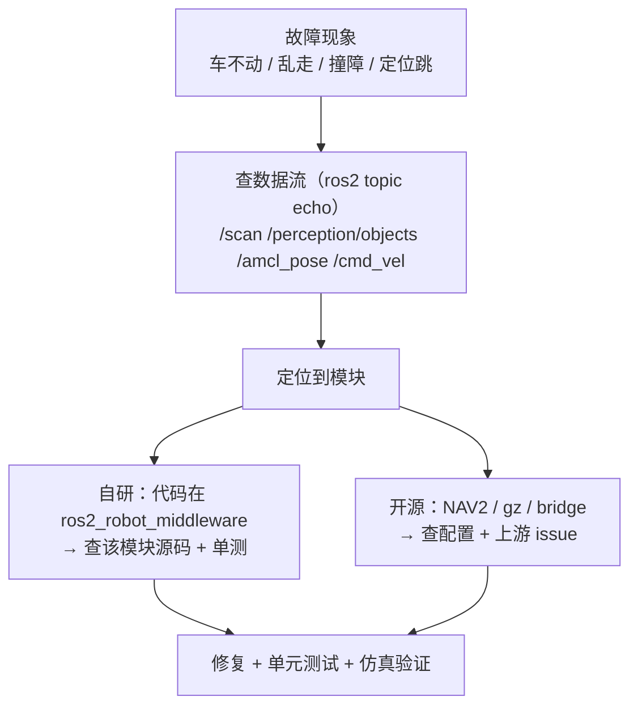

# 架构总览（工作文档，持续更新）

> 用途：**后续所有架构梳理流程的分析都追加到本文档**，标记日期保留历史。
> 图表规范：`/home/guang/code/prompt/references/diagram-spec.md` §6（Mermaid 渲染规避规则）。
> 日期：2026-08-07 建立 / 2026-08-07 按"边界 + 两种视角 + 输入输出表 + 故障定位"重构

---

## 1. 小车边界（谁是小车，谁不是）

- **小车 = 物理体（传感器/执行器）+ 自动驾驶大脑（compute_container）+ 车载定位（AMCL）**
- **compute_container（自研）**：融合感知 + 决策 + 执行，单进程（intra-process 零拷贝）——小车的"大脑"
- **AMCL / map_server / slam_toolbox（开源）**：独立进程，不在计算容器内——小车的"地图/定位外设"
- **仿真器（当前）/ 真车硬件（生产）**：替代 `PHYS`，为大脑提供传感器数据、接收执行指令

## 2. 两种视角

### 2.1 用户视角（使用产品的人）

用户看到的是**两个黑盒**：环境（货架/障碍/道路）和**小车（整车）**。用户不关心内部，只关心**行为是否符合预期**：

| 用户看到的情况 | 预期行为 |
|---|---|
| 前方有障碍 | 减速 / 停车 / 绕行，不撞 |
| 平坦路 | 持续前进 |
| 到达目标点 | 停车，等待下一个任务 |
| 任务下发 | 规划新路线前往 |

### 2.2 开发者视角（调试/排障的人）

开发者看到的**环境黑盒 = 仿真器**。关心：仿真器代替什么真实设备、输出哪些数据、数据流到哪、计算容器内有哪些模块及其输入输出。

## 3. 全系统输入输出表（一张表看全）

| 模块 | 所属 | 输入 | 输出 | 业务含义 |
|---|---|---|---|---|
| fusion_node | 容器内·自研 | `/scan` | `/perception/objects` | 感知：识别障碍物列表 |
| decision_node | 容器内·自研 | `/perception/objects`、`/amcl_pose`、`goal_x/goal_y` | `/cmd/move_to_pose`、`/planning/path` | 决策：绕障规划、派发目标 |
| motor_ctrl_node | 容器内·自研 | `/cmd/move_to_pose`、`/odom`、`/scan` | `/cmd_vel` | 执行：算速度指令（跟踪+绕行+护栏） |
| AMCL | 容器外·开源 NAV2 | `/scan`、`/odom`、`/map` | `/amcl_pose`、`map→odom` TF | 定位：车在地图中的位置 |
| map_server | 容器外·开源 NAV2 | 地图文件 | `/map` | 地图加载 |
| slam_toolbox | 容器外·开源 | `/scan`、`/odom`、`/tf` | 地图（建图） | 建图 |
| Gazebo 仿真 | 容器外·开源 | `/cmd_vel` | `/scan`、`/odom`、`/tf`、`/clock` | 代替真车硬件，物理仿真 |

**关键语义**：
- **`/scan` 一个数据、两个消费者**：fusion（障碍感知）+ motor（护栏/VFH 安全），语义都是"看环境"
- **`/odom` 一个数据、两个消费者**：AMCL（运动模型定位）+ motor（执行闭环），语义都是"看自身"
- **`/clock` 隐式时间源**：全节点 `use_sim_time` 共享
- **决策不消费 bridge 原始数据**：只拿感知的产物（障碍列表）和定位的产物（amcl_pose + TF）

## 4. 坐标系与数据流（定位故障用）

- 坐标系：`map = world + origin(8.162, 9.852)`；decision 在 map 帧规划，派发时经 TF 转 odom 帧给 motor（坐标系 bug 修复点）

## 5. 故障定位流程（出问题怎么办）

**现象 → 数据流检查 → 定位模块 → 判定自研/开源 → 修复**

| 现象 | 先查 | 定位模块 | 自研/开源 | 常见原因 |
|---|---|---|---|---|
| 车不动 | `/cmd_vel` 有无速度 | motor → decision | 自研 | 无目标派发 / 护栏停 / 速度 0 |
| 车乱走出界 | `/amcl_pose` 是否可信 | AMCL → decision | 开源+自研 | 定位漂移 / 地图错 / 坐标系 |
| 车撞障碍 | 撞前 `/cmd_vel` 是否降速 | 护栏/VFH → motor | 自研 | 护栏未触发 / scan 脏（如车体回波） |
| 感知不到障碍 | `/perception/objects` 有无 | fusion | 自研 | `/scan` 断 / 聚类参数 |
| 定位跳变 | `/amcl_pose` 连续性 | AMCL | 开源 | 地图稀疏 / scan 噪声 |
| 仿真器异常 | gz 日志 | 仿真 | 开源 | 物理 / 模型 / gz 服务 |

## 6. 完成度 / 开源 / 闭源

| 模块 | 来源 | 版本 | 完成度 | 商用程度 |
|---|---|---|---|---|
| 感知融合 fusion | 自研 | - | 高（测试绿） | 需数据评测 |
| A* 决策 decision | 自研 | - | 高（G1 全链验证） | 基础可用，需任务集成 |
| PurePursuit 执行 | 自研 | - | 高（闭环） | 需调优 |
| 碰撞护栏 | 自研 | - | 完成（11 GWT） | 安全底线，可用 |
| VFH 绕行 | 自研 | - | 完成（8 GWT） | 待仿真验证 |
| 定位/建图 | 开源 | NAV2 (jazzy) | 集成 | 地图精度受限 |
| 仿真 | 开源 | Gazebo Harmonic 8.14 | 集成 | 开发/评测用 |
| 可观测 | 自研+开源 | Prometheus/Grafana | 高 | 可用 |

### 6.1 计算容器商用差距（2026-08-07 走读评估）

**功能骨架完整**（感知→决策→执行闭环，153 单测绿），差距在"深度 + 可靠性 + 安全认证"：

| 层 | 当前（代码实况） | 商用标准 | 优先级 |
|---|---|---|---|
| 感知 | LiDAR 单模态 DBSCAN 聚类，静态障碍 | 多传感器 EKF + 物体识别分类 + 动态跟踪预测 | P1 |
| 规划 | A* 静态网格 + 单目标（goal_x/y 参数） | 局部动态避障 + 行为树任务 + 多目标优化 | P2 |
| 控制 | PurePursuit + 护栏速度 clamp | MPC + 加速度/jerk 平滑 + 精确到位（±cm） | **P0** |
| 安全 | 单线程护栏逻辑 | SIL2/PL-d 功能安全认证 + 双通道 | P3 |
| 冗余 | 单进程单点 | 双主控热备 + 独立看门狗 | P3 |
| 任务 | 单目标参数 | 任务队列 + 车队协调（Open-RMF） | P2 |

**最现实第一步**：控制层（加速度约束 + 到位精度）——中工作量，直接提升可用性。

## 7. 环境问题 vs 产品问题

**产品问题（已解决/需解决）**：
- ✅ 坐标系错位（decision map goal vs motor odom）— 已修，AMCL 精度 0.15m
- ✅ 护栏数据竞争（跨线程 scan）— 已修
- ✅ decision 死循环（AMCL 漂移）— 随坐标系修复
- ⚠️ VFH 仿真验证（当前卡点）

**环境问题（仿真，非产品缺陷）**：
- ❌ **gz-sim 8 gpu_lidar + ogre2 引擎 bug（2026-08-07 确认，关键）**：
  - 现象：车运动时 gpu_lidar 的 world_pose 不随车更新（卡初始值 x=0.4）→ 渲染用旧位置 → scan 回波消失 → 护栏看不到墙 → 车穿墙
  - 证据：车走 1m，gz /lidar world_pose.x 仍 0.4；车接近墙时 scan 回波从 2.8m 变 inf
  - 社区：gz-sensors #504 / gz-sim #2743 / Gazebo Answers 2023（"Lidar movement not in sync"）——Linux 用户同样遇到，**平台无关**
  - 结论：Windows 原生装 gz-sim 8 同样无法解决（引擎 bug，非 WSL2 特有）；ogre(OGRE1) 在 gz-sim8 不可用（geometry 加载失败）
- ❌ 车 spawn 后滑动：根因 = **残留 `ros2 topic pub` 进程 + gz DiffDrive 保持最后 cmd_vel**（已清理，非物理异常）
- ❌ 2 轮差速车无前后支撑 → 前后倾倒 pitch 16°（已加前后支撑球修复）
- ❌ gz service 查询超时（gz model / gz topic 部分不可用）
- ✅ **bridge 的 LaserScan 转换正常**（之前误判为"丢 beams"，实为 echo 解析错误；rclpy 实测 360 beams，720→360 = 取垂直层）

**关键洞察（2026-08-07 排查沉淀）**：
- 数据链路验证必须用 rclpy 直接数（echo/文本解析会误判数据长度）
- "仿真跑不起来"要区分：车物理（支撑/滑动）、引擎渲染（gpu_lidar world_pose）、桥接（bridge 转换）、业务代码——**逐层隔离**（最小 world → 完整仿真）

---

## 附录：后续架构梳理流程记录

<!-- 每次架构梳理追加一节，格式：
### YYYY-MM-DD <阶段> — <主题>
（L1/L2/L3/L4 图 + 模块分析 + 完成度/开源/闭源 + 环境vs产品）
-->
