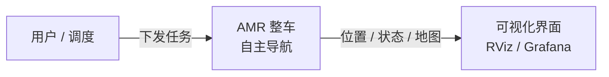
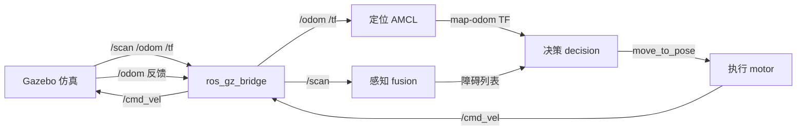
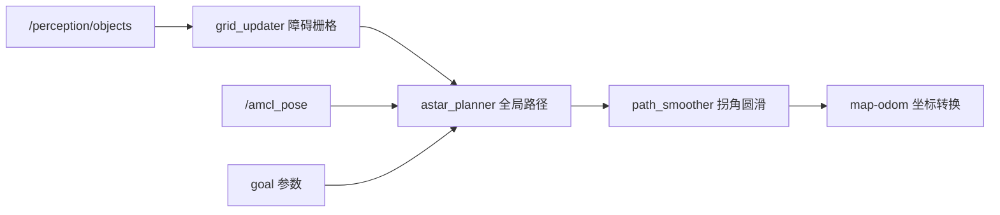
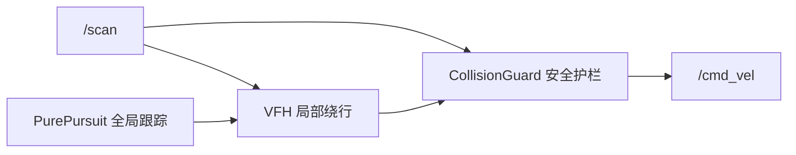

# 架构总览（工作文档，持续更新）

> 用途：**后续所有架构梳理流程（L1 总体 → L2 子系统 → L3 组件 → L4 类接口）的分析都追加到本文档**。
> 每次分析追加一节，标记日期，保留历史，便于回溯进度与边界。
> 图表规范见 `/home/guang/code/prompt/references/diagram-spec.md`（Mermaid 渲染规避规则）。
> 日期：2026-08-07 首次建立

---

## 1. 总体架构

### 1.1 用户视角（L1，黑盒）

从用户角度看，系统是一个"能自主导航的 AMR 整车"：下发任务目标，车执行，用户看到车的状态。内部模块是黑盒。

### 1.2 内部主数据流（L2）

整车内部按「感知 → 决策 → 执行」单向链工作，建图/定位是坐标系地基。

## 2. 逐模块：作用 / 输入 / 输出 / 互联

### 2.1 仿真环境（开源 — Gazebo Harmonic 8.14）
| 项 | 内容 |
|---|---|
| **作用** | 物理世界 + 传感器真值：车（DiffDrive 差速 + GPU LiDAR 360° + IMU）、仓库场景（货架/障碍） |
| **输入** | `/cmd_vel`（速度指令） |
| **输出** | `/scan`（激光）、`/odom`（位姿）、`/tf`、`/clock`（仿真时钟） |
| **互联** | 经 bridge 与全系统通信；当前唯一"真值"来源，**产品代码不依赖它**（HAL 可切真车） |

### 2.2 建图 / 定位（开源 — slam_toolbox + NAV2）
| 项 | 内容 |
|---|---|
| **作用** | 建图（slam_toolbox 扫场地生成地图）→ 已知地图导航（map_server 加载 + AMCL 粒子滤波定位） |
| **输入** | `/scan`、`/odom`、`/tf` |
| **输出** | `map→odom` TF、`/amcl_pose`（map 帧车位置） |
| **互联** | 喂给 decision 作 A* 起点和坐标系基准；**坐标系定义者**（map = world + origin） |

### 2.3 感知子系统（自研 — fusion_node）
| 项 | 内容 |
|---|---|
| **作用** | 多传感器融合：LiDAR 聚类 → Kalman 跟踪 → 障碍物列表。含降级策略（传感器故障保底） |
| **输入** | `/scan`（+ 可选 IMU/相机/PCL） |
| **输出** | `/perception/objects`（map 帧障碍：id/位置/速度） |
| **互联** | 喂给 decision 作为**障碍**（不是目标）；独立进程（故障隔离） |

### 2.4 决策子系统（自研 — decision_node，任务层入口）
| 项 | 内容 |
|---|---|
| **作用** | 全局路径规划：障碍标进栅格 → A* 绕障 → 平滑 → 派发执行目标。目标是**任务来源**（当前参数，未来 Fleet Manager） |
| **输入** | `/perception/objects`（障碍）、`/amcl_pose`（A* 起点）、`goal_x/goal_y`（任务，map 帧） |
| **输出** | `/planning/path`（map 帧展示）、`/cmd/move_to_pose` action（odom 帧目标） |
| **互联** | 接收感知障碍 + 定位位姿；派发前经 **map→odom TF 转换**；收到执行失败后重规划 |

### 2.5 执行子系统（自研 — motor_ctrl_node）
| 项 | 内容 |
|---|---|
| **作用** | 三级速度控制：PurePursuit（全局跟踪）→ VFH（局部绕行）→ CollisionGuard（安全硬停）→ 偏差监控 |
| **输入** | `/cmd/move_to_pose` action（odom 帧目标）、`/odom`（闭环位姿）、`/scan`（护栏+VFH） |
| **输出** | `/cmd_vel`（速度指令）、action 结果（成功/失败回报） |
| **互联** | 决策层的执行器；阻塞 3s 失败回报触发重规划；`/cmd_vel` 经 bridge 到仿真 |

### 2.6 监控子系统（自研 + 开源）
| 项 | 内容 |
|---|---|
| **作用** | health_monitor（心跳/降级/恢复）+ Prometheus 指标 + Grafana 可视化 |
| **输入** | 各节点心跳、指标 |
| **输出** | 告警、Grafana 面板 |
| **互联** | 横向贯穿，不参与主数据流 |

### 2.7 HAL 层（自研，面向真车）
| 项 | 内容 |
|---|---|
| **作用** | 硬件抽象：`isensor`/`iactuator` + 传感器适配器（sick_tim781）+ 模拟实现。**仿真/真车切换点** |
| **互联** | 感知/执行经 HAL 访问硬件；当前仿真走模拟路径 |

### 2.8 任务层（现状 + 未来）
- 当前：`goal_x/goal_y` launch 参数（单机单任务）
- 未来：fleet_manager_node（已建骨架）→ 多车调度/WMS 对接

## 3. 模块间关系要点

1. **单向依赖链**：`感知 → 决策 → 执行`，各层只对下游发指令；上游感知不决策（感知障碍 ≠ 导航目标）
2. **两个坐标系交汇在决策层**：决策在 map 帧规划（A*），派发时转 odom 帧给执行（坐标系 bug 修复点）
3. **开源组件是"地基"**（仿真、定位、建图），**自研是"大脑和手脚"**（感知融合、决策、执行）
4. **执行层是安全底线**：感知/决策全错时，护栏（scan 级）保证不撞、不死锁

## 4. 决策子系统展开（L3）

## 5. 执行子系统展开（L4）

### CollisionGuard 类接口

| 方法 | 签名 | 职责 |
|---|---|---|
| `set_scan` | `(ScanData, time_point)` | 线程安全存储最新 scan |
| `clamp` | `(float cmd_v, time_point) → float` | 障碍在 stop 区→0，safe 区→线性降速 |
| `stopped` | `(time_point) → bool` | 护栏是否强制停 |
| `blocked_for` | `(time_point) → ms` | 阻塞时长（防死锁超时） |
| `snapshot` | `() → ScanData` | 供 VFH 的线程安全 scan 拷贝 |

## 6. 完成度 / 开源 / 闭源

| 模块 | 来源 | 版本 | 完成度 | 商用程度 |
|---|---|---|---|---|
| 感知融合 | 自研 | - | 高（测试绿） | 需数据评测 |
| A* 决策 | 自研 | - | 高（G1 全链验证） | 基础可用，需任务集成 |
| PurePursuit 执行 | 自研 | - | 高（闭环） | 需调优 |
| 碰撞护栏 | 自研 | - | 完成（11 GWT） | 安全底线，可用 |
| VFH 绕行 | 自研 | - | 完成（8 GWT） | 待仿真验证 |
| 建图/定位 | 开源 | slam_toolbox/NAV2 (jazzy) | 集成 | 地图精度受限 |
| 仿真 | 开源 | Gazebo Harmonic 8.14 | 集成 | 开发/评测用 |
| 可观测 | 自研+开源 | Prometheus/Grafana | 高 | 可用 |

## 7. 环境问题 vs 产品问题

**产品问题（已解决/需解决）**：
- ✅ 坐标系错位（decision map goal vs motor odom）— 已修，AMCL 精度 0.15m
- ✅ 护栏数据竞争（跨线程 scan）— 已修
- ✅ decision 死循环（AMCL 漂移）— 随坐标系修复
- ⚠️ VFH 仿真验证（当前卡点）

**环境问题（仿真，非产品缺陷）**：
- ❌ 车 spawn 后异常滑动 0.94m（无 cmd_vel 却移动）
- ❌ LiDAR 检测车体自身（最小 world 证实 0.68m 车体弧线；warehouse 里 0.2m）
- ❌ gz service 大面积不可用（查询超时）

---

## 附录：后续架构梳理流程记录

<!-- 每次架构梳理追加一节，格式：
### YYYY-MM-DD <阶段> — <主题>
（L1/L2/L3/L4 图 + 模块分析 + 完成度/开源/闭源 + 环境vs产品）
-->
